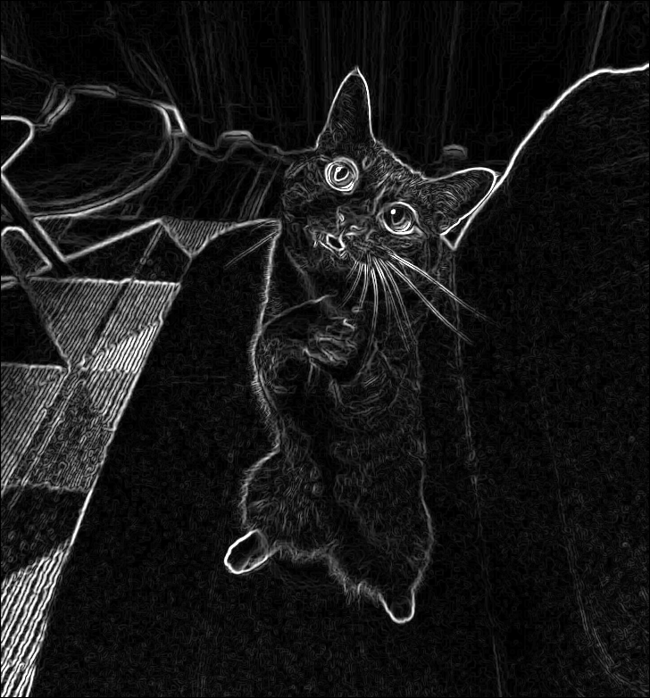

# Lab 3: Sobel Operator - Оператор Собеля

## Описание
**Цель работы**:  
Реализовать алгоритм выделения границ на изображении с помощью оператора Собеля, используя возможности параллельных вычислений на графическом процессоре (CUDA).

**Что было сделано**:
- Реализованы функции чтения/записи изображений в форматах PGM и BMP
- Разработан kernel sobelFilter с использованием shared memory и обработки гало-зоны (halo / boundary padding)
- Измерено время выполнения ядра с помощью cudaEvent
- Протестировано на стандартных изображениях

## Компиляция
```bash
make
```

## Запуск программы
```bash
./program images/<Название входного изображения> images/<Название выходного>
```

## Результаты

Время выполнения ядра на различных изображениях:

| Изображение         | Размер       | Время ядра (мс) |
|---------------------|--------------|------------------|
| House.bmp           | 256 × 256    | 0.12            |
| otpusk.pgm          | 260 × 194    | 0.12            |
| Tiffany.bmp         | 512 × 512    | 0.12            |
| cat.bmp             | 728 × 782    | 0.12            |
| wallpaper.bmp       | 1920 × 1080  | 0.13            |

Видно, что время выполнения очень стабильно и слабо зависит от размера изображения.
<br>
После замены clamp на max/min время выполнения уменьшилось:
<br>


<br>

| Изображение         | Размер       | Время ядра (мс) |
|---------------------|-------------|------------------|
| House.bmp           | 256 × 256    | 0.09            |
| otpusk.pgm          | 260 × 194    | 0.09            |
| Tiffany.bmp         | 512 × 512    | 0.11            |
| cat.bmp             | 728 × 782    | 0.07            |
| wallpaper.bmp       | 1920 × 1080  | 0.12            |


### Исходное изображение и результат

Исходное:  


Результат Собеля:  


Результат Собеля после замены clamp на max/min:  


**Otpusk.pgm**  
Исходное:  


Результат:  


Результат Собеля после замены clamp на max/min:  


**Tiffany.bmp**  
Исходное:  


Результат:  


Результат Собеля после замены clamp на max/min:  


**Cat.bmp**  
Исходное:  


Результат:  


Результат Собеля после замены clamp на max/min:  


**Wallpaper.bmp** 
Исходное:  


Результат:  


Результат Собеля после замены clamp на max/min:  


## Выводы
- Использование shared memory снижает количество обращений к глобальной памяти.
- Обработка граничных условий через clamp и загрузка гало-областей позволяет корректно считать градиент у краёв тайлов.
- Программа корректно работает как с PGM (P5), так и с 24-битными BMP-файлами (преобразуя в grayscale по формуле 0.299R + 0.587G + 0.114B).
- Полученные результаты выделяют контуры объектов на всех тестовых изображениях.
